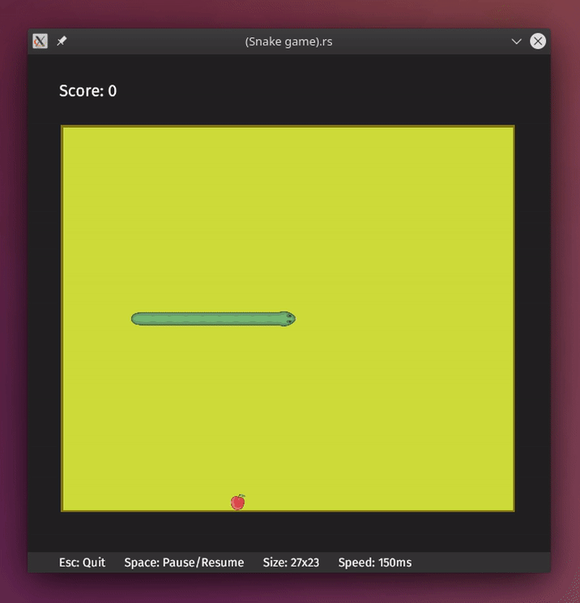

# (Snake game).rs

One more snake game. 
Made for fun using [piston](https://github.com/PistonDevelopers/piston) game engine 
and sprites from [here](https://github.com/rembound/Snake-Game-HTML5). 
Thanks to both!

### How it looks



### How to run
```shell script
git clone https://github.com/emgyrz/snake.rs.git
cd snake.rs/
cargo run
```
or download binaries from [releases](https://github.com/emgyrz/snake.rs/releases) section.


### License

This is [MIT licensed](./LICENSE).

